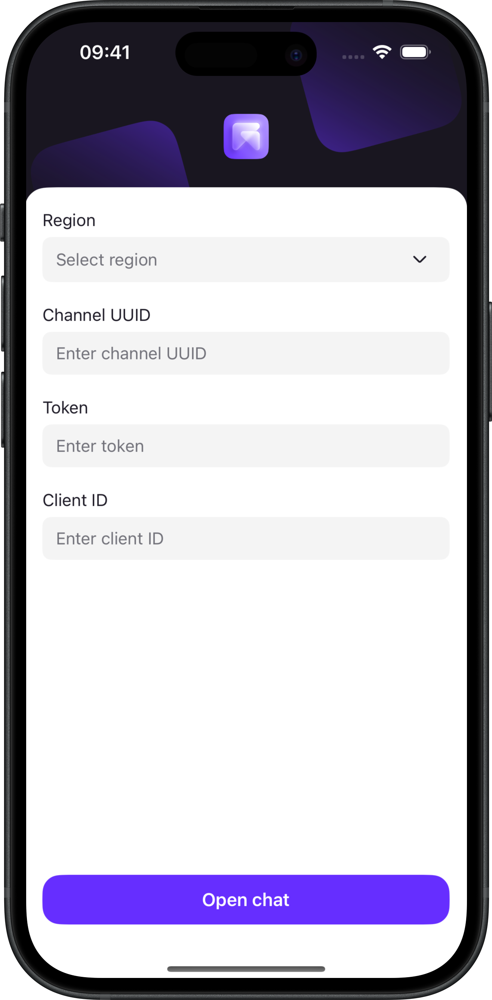
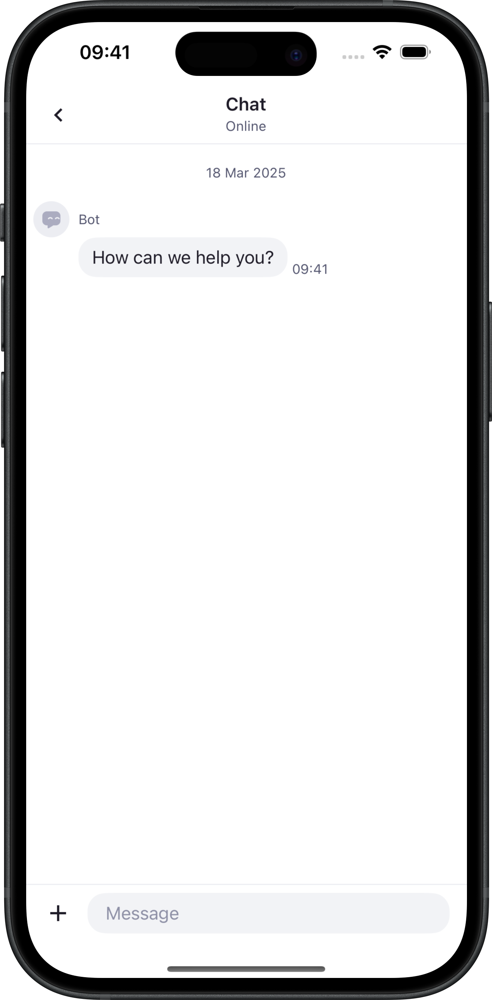

# Voximplant Kit Chat iOS Demo

This demo app demonstrates the Voximplant iOS Kit Chat UI SDK that allows you to add in-app messaging
into your iOS application with a ready-to-go user experience.

## Getting started

To get started, you need to [register](https://kit.voximplant.com/registration?lang=) a Voximplant Kit account
and [create](https://voximplant.com/kit/docs/setup/conversations/channels/mobilechat) a mobile chat channel.

## Build and install

1. Clone this repository.
2. Open the repository in Xcode.
3. Wait for package dependencies resolve and build for the target device.

## Usage

 

Enter your mobile chat channel details (region, channel UUID, token) and a client Id.

> [!IMPORTANT]
> Client Id is a random string that should match the regexp pattern `[a-zA-Z0-9@#$_\-+\.]`.

## Push notifications

Push notifications require additional setup.

1. Change the application bundle Id.
2. Register a new application bundle Id in your Apple Developer account.
3. Generate an APNS certificate for a new application bundle Id in p12 format.
4. [Upload](https://voximplant.com/kit/docs/setup/conversations/pushcertificates#uploading-push-certificates-to-voximplant-kit) it to Voximplant Kit.
5. Select the uploaded certificate in the mobile chat channel.
